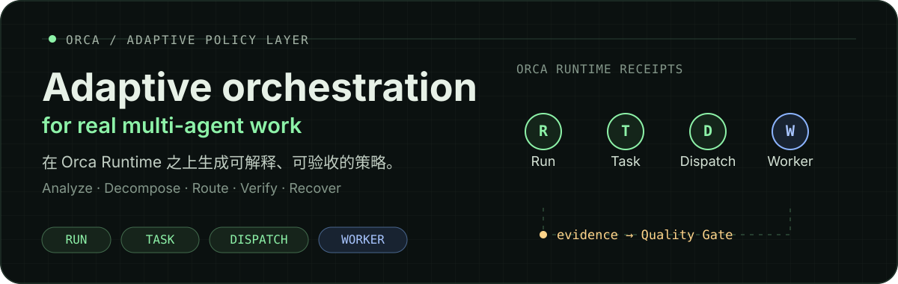
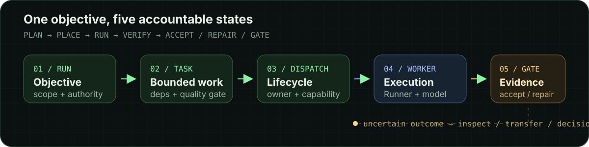

<p align="center">
  
</p>

<p align="center">
  <a href="#中文">中文</a> · <a href="#english">English</a>
</p>

<h1 id="中文">Orca Adaptive Orchestration</h1>

> Orca Runtime 之上的显式 Policy Skill：分析目标、拆解任务、按能力路由、独立验收，并选择有边界的恢复策略。

它决定“做什么、为什么、由谁做、怎样验收”，并把 Run、Task、Dispatch、Worker、终端和清理等生命周期操作委托给当前版本的 Orca 官方指南。

## 它能做什么

- **把目标变成可解释的执行策略**：生成 Execution Manifest，明确任务、依赖、并发、能力、Worktree 和 PR Unit 决策。
- **委托 Orca 执行**：以官方 `orca-cli` 和 `orchestration` 指南为生命周期真相源，只根据其 receipt 记录实际状态。
- **按真实能力路由**：区分 Runner 和 Effective Model，再根据任务风险选择 Flash、Pro 或 Strong fallback，而不是从 CLI 名称猜能力。
- **支持安全的强制派发**：通过 `强制派发` / `force-dispatch` 快速进入约束明确的并行工作流，同时保留任务分解、隔离、Quality Gate 和权限边界。
- **用 Quality Gate 验收结果**：Worker 的成功回执只是证据；Skill 会独立检查交付物，并在验证失败时创建有边界的 Repair Task。
- **在失败时选择恢复策略**：先分类失败并保留证据，再选择有限重试、Transfer、Repair 或 Decision Gate；具体生命周期操作由 Orca 执行。

## 工作方式

<p align="center">
  
</p>

1. **Analyze** — 读取仓库、运行时、Runner 和模型证据。
2. **Decompose** — 形成有明确输入、输出、依赖、所有权和验收标准的 Task 图。
3. **Route** — 按能力、风险、约束和可用性选择 Worker 组合。
4. **Verify** — 独立检查 Quality Gate，不把 Worker 报告当作验收。
5. **Recover** — 分类失败并选择有限重试、Transfer、Repair 或 Decision Gate。

## 快速开始

在 Codex 中加载此 Skill：

```text
$orca-adaptive-orchestrator
```

普通模式会先展示计划并等待确认。需要快速进入受约束的强制编排时，使用精确触发词：

```text
强制派发；max-workers=2；Runner=opencode；model=default：
把这个目标拆成两个可监督的并行任务，并在完成后独立验收。
```

强制派发仍受以下边界约束：最多四个并发 Worker；所有 Task 先创建再启动第一波；远程发布、部署、强制 push、历史重写和破坏性操作不会被隐式授权。

## 四种执行模式

| 模式 | 用途 |
| --- | --- |
| **Default** | 只读调查并展示 Execution Manifest，等待确认 |
| **Plan only** | 只产出计划，不创建 Orca 状态或修改文件 |
| **Direct execution** | 用户明确授权后直接执行 Manifest 中列出的本地效果 |
| **Force dispatch** | 使用显式 Runner/模型约束快速派发，仍保留监督与 Quality Gate |

## 关键设计

### Runner ≠ Effective Model

Runner 是 Worker 使用的 Agent CLI；Effective Model 是经过当前配置与别名解析后真正调用的模型。路由逻辑以 Effective Model 和任务所需的 Capability Tier 为依据，避免把 `opencode`、`claude` 或其他 CLI 名称当成模型能力。

### Policy Layer ≠ Orca Runtime

本 Skill 只拥有 Analyze、Decompose、Route、Verify、Recover 决策。Run、Task、Dispatch、Worker、消息、终端和清理由版本匹配的 Orca 指南定义，项目不复制其命令语法和状态机。

### 结果必须通过 Quality Gate

Worker 的报告不能代替验收。Quality Gate 关注可观察的文件、测试、UI 状态、持久化结果或其他交付证据；验证失败时使用独立 Repair Task，而不是把失败伪装成普通重试。

## 仓库内容

- [`orca-adaptive-orchestrator/SKILL.md`](./orca-adaptive-orchestrator/SKILL.md) — 精简的 Policy Layer 入口
- [`references/`](./orca-adaptive-orchestrator/references/) — 按需加载的分解、Manifest、路由与强制派发策略
- [`scripts/inspect_runtime.py`](./orca-adaptive-orchestrator/scripts/inspect_runtime.py) — 只输出白名单运行时与模型路由信息
- [`docs/orca-adaptive-orchestrator-architecture-zh.html`](./docs/orca-adaptive-orchestrator-architecture-zh.html) — 架构图
- [`docs/orca-adaptive-orchestrator-dataflow-zh.html`](./docs/orca-adaptive-orchestrator-dataflow-zh.html) — 数据流图
- [`docs/adr/0001-route-by-effective-model-and-supervised-lifecycle.md`](./docs/adr/0001-route-by-effective-model-and-supervised-lifecycle.md) — Effective Model 与监督生命周期 ADR

## 验证

```bash
python3 -m unittest discover -s orca-adaptive-orchestrator/tests -v
python3 orca-adaptive-orchestrator/scripts/inspect_runtime.py --pretty
```

---

<h1 id="english">English</h1>

> An explicit Policy Skill above Orca Runtime: analyze goals, decompose Tasks, route by capability, verify independently, and choose bounded recovery.

It decides what should happen and why, who should own it, and how it will be accepted. Version-matched Orca guides own Run, Task, Dispatch, Worker, terminal, messaging, and cleanup mechanics.

## What it does

- **Turns goals into explainable execution policy** — produces an Execution Manifest covering Tasks, dependencies, concurrency, capability, Worktree, and PR Unit decisions.
- **Delegates execution to Orca** — treats official `orca-cli` and `orchestration` guides plus runtime receipts as the lifecycle source of truth.
- **Routes by real capability** — separates the Runner CLI from the Effective Model and selects Flash, Pro, or a strong fallback based on task risk.
- **Supports constrained force dispatch** — uses the exact `强制派发` / `force-dispatch` trigger for fast, explicit parallel coordination while retaining decomposition, isolation, Quality Gates, and authority boundaries.
- **Accepts evidence, not claims** — treats Worker reports as evidence and validates deliverables independently; failed validation becomes a bounded Repair Task.
- **Chooses recovery without losing context** — classifies failures and preserves evidence before selecting bounded retry, Transfer, Repair, or a Decision Gate; Orca performs the lifecycle operation.

## How it works

1. **Analyze** — inspect repository, runtime, Runner, and model evidence.
2. **Decompose** — form a Task graph with explicit inputs, outputs, dependencies, ownership, and acceptance.
3. **Route** — select Worker combinations from capability, risk, constraints, and availability.
4. **Verify** — inspect Quality Gates independently of Worker claims.
5. **Recover** — classify failure and choose bounded retry, Transfer, Repair, or a Decision Gate.

## Quick start

Load the Skill in Codex:

```text
$orca-adaptive-orchestrator
```

The default mode presents a plan and waits for confirmation. For a constrained fast path, use the exact trigger:

```text
force-dispatch; max-workers=2; Runner=opencode; model=default:
Split this goal into two supervised parallel tasks and independently verify the result.
```

Force dispatch still caps concurrency at four Workers, creates all Tasks before the first wave, and never implicitly authorizes remote publication, deployment, force pushes, history rewrites, or destructive actions.

## Execution modes

| Mode | Use |
| --- | --- |
| **Default** | Read-only investigation plus an Execution Manifest, then confirmation |
| **Plan only** | Produce the plan without creating Orca state or changing files |
| **Direct execution** | Execute the locally authorized effects listed in the Manifest |
| **Force dispatch** | Dispatch with explicit Runner/model constraints while retaining supervision and Quality Gates |

## Design principles

### Runner is not the Effective Model

The Runner is the Agent CLI used by a Worker. The Effective Model is the model resolved through the current configuration and aliases. Routing uses the Effective Model and the required Capability Tier, so `opencode`, `claude`, and other CLI names are never treated as capability identities.

### Policy Layer is not Orca Runtime

This Skill owns Analyze, Decompose, Route, Verify, and Recover decisions. Version-matched Orca guides define Run, Task, Dispatch, Worker, message, terminal, and cleanup semantics; this project does not copy their command grammar or state machine.

### Quality Gates define completion

A Worker report does not replace acceptance. Quality Gates inspect observable files, tests, UI state, persistence, or other deliverable evidence. Failed validation creates an independent Repair Task instead of being relabeled as a runtime retry.

## Repository map

- [`orca-adaptive-orchestrator/SKILL.md`](./orca-adaptive-orchestrator/SKILL.md) — thin Policy Layer entrypoint
- [`references/`](./orca-adaptive-orchestrator/references/) — conditionally loaded decomposition, Manifest, routing, and force-dispatch policy
- [`scripts/inspect_runtime.py`](./orca-adaptive-orchestrator/scripts/inspect_runtime.py) — allow-listed runtime and model-routing inspection
- [`docs/orca-adaptive-orchestrator-architecture-zh.html`](./docs/orca-adaptive-orchestrator-architecture-zh.html) — architecture diagram
- [`docs/orca-adaptive-orchestrator-dataflow-zh.html`](./docs/orca-adaptive-orchestrator-dataflow-zh.html) — data-flow diagram
- [`docs/adr/0001-route-by-effective-model-and-supervised-lifecycle.md`](./docs/adr/0001-route-by-effective-model-and-supervised-lifecycle.md) — Effective Model and supervised lifecycle ADR

## Validation

```bash
python3 -m unittest discover -s orca-adaptive-orchestrator/tests -v
python3 orca-adaptive-orchestrator/scripts/inspect_runtime.py --pretty
```

<p align="center"><sub>Built for explicit, evidence-based coordination through Orca.</sub></p>
